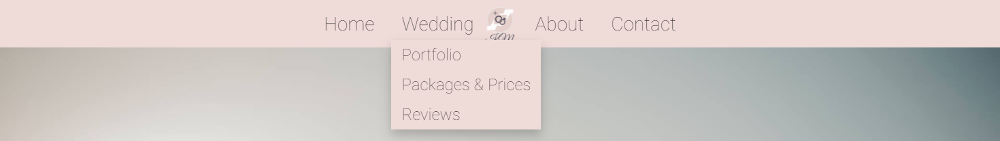
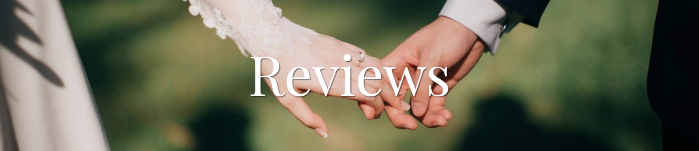
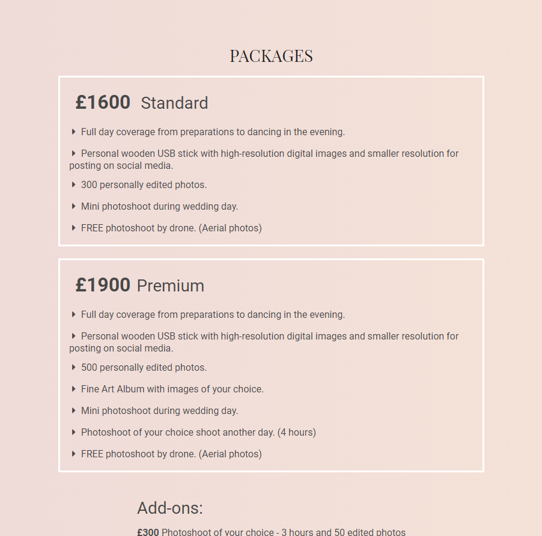
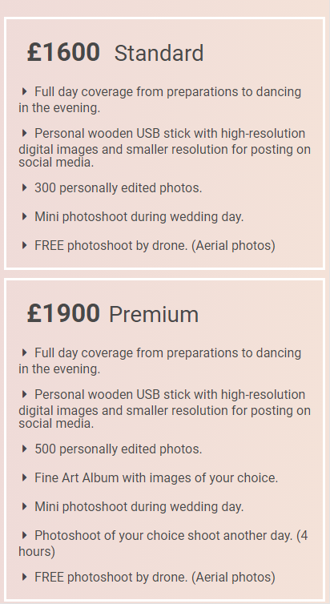
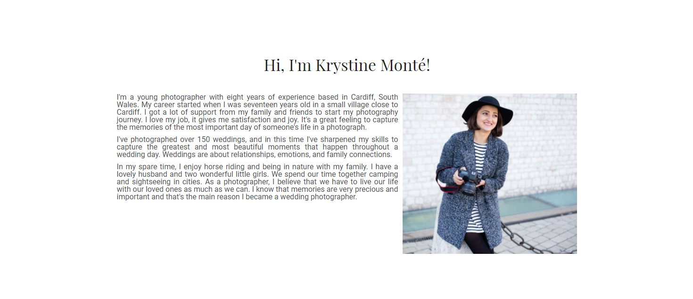

# Klaudia Matysiak - 1 Milestone Project - Wedding Photography Portfolio

My 1 Milestone Project is website designed for a non-existing photographer named Krystine Monté based in Cardiff. I always wanted to be a wedding photographer, so this project is my vision of how my website would look like. I would like the page to be in the perception of a wedding as a magical dream. It's designed to be responsive at all devices.

[View the live project here.](https://klaudiamatysiak.github.io/1MP-Matysiak/)

# User Experience (UX)
## User Stories
* First Time Visitors Goals
    1. As a First Time Visitor, I want to easly navigate through the web page to find content and understand main purpose of the website.
    2. As a First Time Visitor, I want to check photographer's portfolio.
* Returning Visitors Goals
    1. As a Returning Visitor, I want to find pirce list and packeges. 
    2. As a Returning Visitor, I want to contact with photographer to check her availability at my wedding date.

## Design

I decided to choose simple layout of main color Misty Rose, with accent of Pale Pink, and to contrast main background color is white, and general text color is Davys Grey. In my opinion those colors match perfect for the wedding portfolio.

## Wireframes
I created wireframes in the balsamiq program as first visual concept of the website.

* [Desktop Wireframe](documentation/files/desktop-wedding-portfolio.pdf)

* [Mobile Wireframe](documentation/files/mobile-wedding-portfolio.pdf)

# Features
## Navigation Bar
* The navigation bar style is consistent. It will navigate user through the website. Main bar includes links to the Home, About and Contact page, while hovering on the Wedding it shows submenu which includes link to the Portfolio, Packages & Prices and Reviews page. For the screen of maximum size 960 pixels element of the menu will shrink font size from 28 px to 20 px and for the mobile screen of maximum size 480 pixels navbar will change for the humberger menu on the right and logo on the left.

## Hero Image
* The home page includes a background hero image of the Bride and Groom which is main focus on the page. The image welcomes user into world of the wedding photography. On the middle there is title of the website to inform user what conent can find here.

## Congratulations
* Section contain congratulations for user's engagement. User should feel welcome, appreciate and special on the website, and know that can find here good and experienced photographer for their wedding.

## What's next?
* Section contain appealing buttons which point direction that user can take next on the website.

## Footer
* Footer includes social media links to the Facebook, Instagram and TikTok and developer's copyright.

## Title on the Pages
* On the Portfolio, Packages & Prices, Reviews, About and Contact Pages display title with a background photo.

## Portfolio Gallery
* Gallery section contains wedding pictures taken by a photographer. It is valuable part of the website to the user to easily identify photography style and approach. For the Gallery used CSS GRID code is used so it is responsive on all the devices.
* Desktop View 

* Tablet View (maximum screen size of 960px)

* Mobile View (maximum screen size of 480px)

## Contact Button
* This section contains a link, styled like button, to a Contact Page. To style this element I used CSS:hover library and chose float animation. User can find "Contact Button" in the end of the all pages, exlude Home Page which has "What's next" section and Contact Page which doesn't need a link to it.

## Packages
* In the Packages section user can find infromation what each package contains and its price. User can easly find information about Add-ons, which can add on to the offer or choose services on its own.
* Desktop View

* Tablet View

* Mobile View

## Types of the Photoshoots
* This section contains types of the photoshoots with a collage background of examples from an individual photoshoots. User has an pictorial information about types of photoshoots.
* Desktop View

* Tablet View

* Mobile View

## Reviews
* Section contains a reviews from clients of the photographer Krystine Monté that user can read positive recomendation. I used Random Name Generator and search for Google Reviews about Cardiff photographers to make a reviews from non-existing clients.

## About
* Section contains: 
    - header with greetings from Krystine Montéu,
    - paragraphs about Krystine Monté and her experience,
    - image of Krystine Monté.
* Desktop View 

* Tablet View 

* Mobile View

## Contact Form

# Testing
## HTML
* The [W3C School Validator](https://validator.w3.org/#validate_by_uri) were used to validate the HTML code on the project.
* Home Page - [link to the Home Page HTML Validator](https://validator.w3.org/nu/?doc=https%3A%2F%2Fklaudiamatysiak.github.io%2F1MP-Matysiak%2Findex.html)

## CSS
* The [W3C School CSS Validator](https://jigsaw.w3.org/css-validator/validator.html.en) where used to validate CSS code on the project.
* Home Page - [link to the Home Page CSS Validator](https://jigsaw.w3.org/css-validator/validator?uri=https%3A%2F%2Fklaudiamatysiak.github.io%2F1MP-Matysiak%2Findex.html&profile=css3svg&usermedium=all&warning=1&vextwarning=&lang=en)

## Lighthouse DevTools
* The [Lighthouse Tools for Web Developer](https://developers.google.com/web/tools/lighthouse) were used to generate report how well the page did.
* Desktop 

* Mobile 

# Technologies Used
## Languages Used:
* HTML5
* CSS3
* JavaScript

## Frameworks, Libraries & Programs Used
* [Font Awesome](https://fontawesome.com/) 
* [Google Fonts](https://fonts.google.com/)
* [Balsamiq](https://balsamiq.com/)
* [Hover:CSS](https://ianlunn.github.io/Hover/)
* [Fancybox](https://fancyapps.com/docs/ui/fancybox/plugins/image/)

# Credits
## Images
* https://unsplash.com/photos/IfjHaIoAoqE
* https://unsplash.com/photos/zMD_a665huA
* https://www.facebook.com/photo/?fbid=988862457838330&set=a.132545638872676
* https://unsplash.com/photos/BlKIiqK-H78
* https://unsplash.com/photos/y4bE8ST_CTg
* https://unsplash.com/photos/g3oEF_BNXwE
* https://unsplash.com/photos/deBjhdlHBXc
* https://unsplash.com/photos/FTW8ADj5igs
* https://unsplash.com/photos/GcGLl7JkzhE
* https://www.pngitem.com/middle/ixohobx_5-star-review-google-reviews-logo-transparent-hd/
* https://unsplash.com/photos/RHAtRIT3-CE
* https://unsplash.com/photos/5BB_atDT4oA
* https://unsplash.com/photos/dvF6s1H1x68
* https://unsplash.com/photos/lR--zjgQRY0
* https://unsplash.com/photos/JFAPl7brL6U
* https://unsplash.com/photos/JiaYVFD3isE
* https://unsplash.com/photos/mW8IZdX7n8E
* https://unsplash.com/photos/Z-Edp122ryw
* https://unsplash.com/photos/DmUbkltYsKI
* https://unsplash.com/photos/--LyFIjXoFY
* https://unsplash.com/photos/Ys-27LJxMIo
* https://unsplash.com/photos/NBtkkWD4sGM
* https://unsplash.com/photos/8DK7qh8kjNg
* https://unsplash.com/photos/H_cZqryUuok
* https://unsplash.com/photos/8yPA6ZYq0-s
* https://unsplash.com/photos/87DgFV9SOc4
* https://unsplash.com/photos/8WODX7nO2JE
* https://www.instagram.com/p/Bd0ECfFnpCs/
* https://www.instagram.com/p/BcDZ1qEFiQr/
* https://www.instagram.com/p/BW3f3U9F-qs/
* https://www.instagram.com/p/BcItqd1F7b7/
* https://unsplash.com/photos/69UhCdWsUO4
* https://unsplash.com/photos/CLD1i8hp008
* https://unsplash.com/photos/d_9i9TaOxfI
* https://unsplash.com/photos/tqunk3qB_yU
* https://unsplash.com/photos/PCHYLGhHV2U
* https://unsplash.com/photos/XReCuboiTcw
* https://unsplash.com/photos/9Evqbiy9Lj8
* https://unsplash.com/photos/6GmVt60qwlY
* https://unsplash.com/photos/w7qXr_E-1IM
* https://unsplash.com/photos/i6srrLYeS-A
* https://unsplash.com/photos/X3DZ1c7MPa4

## Design
* [Logo design](https://www.freelogodesign.org/) - I create logo on the website.
* [Colors](https://coolors.co/) - I chose colors for the design by myself. I only use this website to show palette in the README file.
## Code
* [CSS Flexbox](https://css-tricks.com/snippets/css/a-guide-to-flexbox/)
* [Dropdown submenu](https://www.w3schools.com/css/css_dropdowns.asp) 
* [CSS reset](https://meyerweb.com/eric/tools/css/reset/)
* [Hamburger menu in Javascript](https://www.youtube.com/watch?v=ydZc17rlR5E)
* [Responsive Image Grid for Portfolio Gallery](https://www.w3schools.com/howto/howto_css_image_grid_responsive.asp)
## Other
* [Random name generator](https://www.behindthename.com/random/) - I generate random names for fake clients reviews.
* [Reviews about photographer](https://www.google.com/search?q=wedding+photographer+cardiff&tbm=lcl&sxsrf=ALeKk0171Aoepdz-NCRvxKKyN_iCIhC9Lw%3A1628610435059&ei=g58SYZ7-AoOo8gLr4q5I&oq=wedding+photographer+cardiff&gs_l=psy-ab.12...0.0.0.12140.0.0.0.0.0.0.0.0..0.0....0...1c..64.psy-ab..0.0.0....0.SIZkvfOa0EQ#rlfi=hd:;si:;mv:[[51.5405251,-3.0837762],[51.4454608,-3.2447312999999998]];tbs:lrf:!1m4!1u3!2m2!3m1!1e1!1m4!1u2!2m2!2m1!1e1!2m1!1e2!2m1!1e3!3sIAE,lf:1,lf_ui:14) - I pick four random reviews from google reviews about photographers based in Cardiff.
* [Compressed size of the images](https://tinypng.com/)
