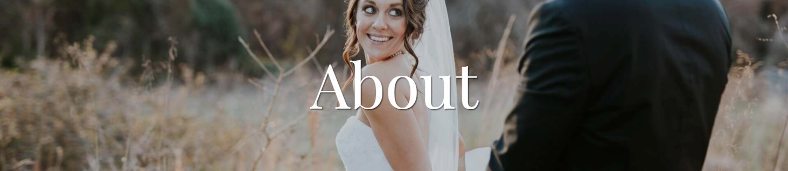
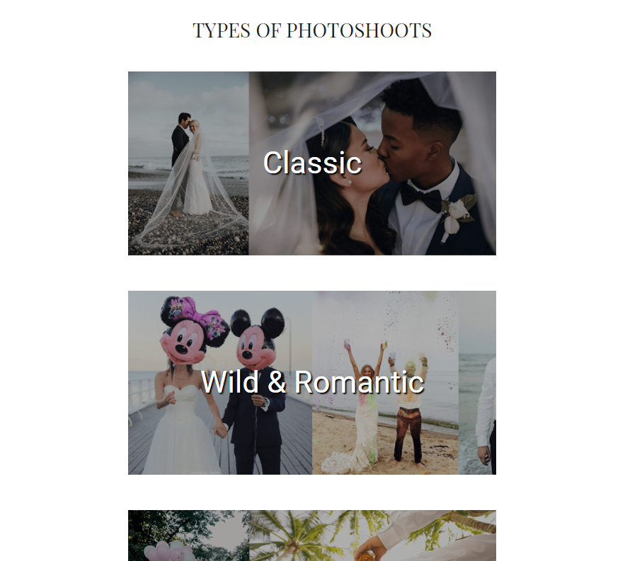
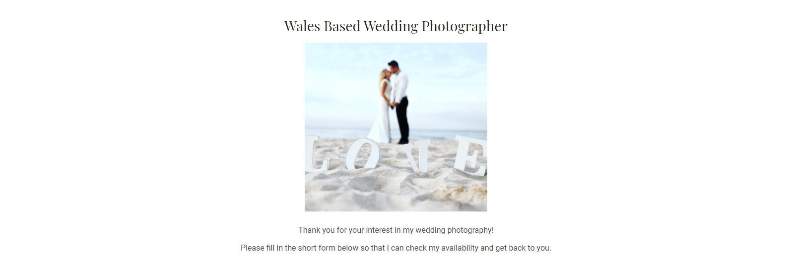
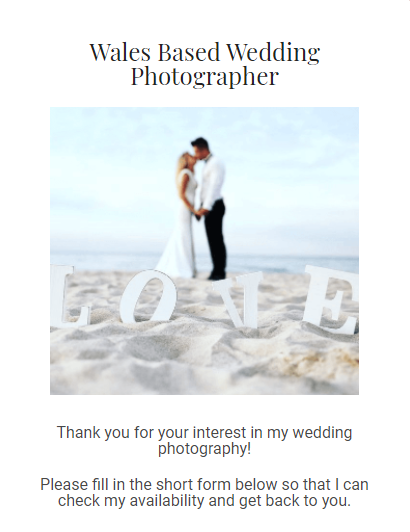

# Klaudia Matysiak - 1st Milestone Project - Wedding Photography Portfolio

My 1st Milestone Project is website designed for a non-existing photographer named Krystine Monté based in Cardiff. I always wanted to be a wedding photographer, so this project is my vision of how my website would look like. I would like the page to be in the perception of a wedding as a magical dream. It's designed to be responsive at all devices.

[View the live project here.](https://klaudiamatysiak.github.io/Wedding-Photography-Portfolio/index.html)

# User Experience (UX)
## User Stories
* First Time Visitors Goals
    1. As a First Time Visitor, I want to easly navigate through the web page to find content and understand main purpose of the website.
    2. As a First Time Visitor, I want to check photographer's portfolio.
* Returning Visitors Goals
    1. As a Returning Visitor, I want to find price list and packeges. 
    2. As a Returning Visitor, I want to contact with photographer to check her availability for my wedding date.
    3. As a Returning Visitor, I want to check the reviews of the previous customers.

## Design

I decided to choose simple layout of main color Misty Rose, with accent of Pale Pink, and to contrast main background color is white, and general text color is Davys Grey. In my opinion those colors match perfect for the wedding portfolio.

## Wireframes
I created wireframes in the balsamiq program as first visual concept of the website.

* Desktop Wireframe - Full PDF file with desktop wireframes you can find [here](documentation/files/desktop-wedding-portfolio.pdf)

* Desktop Wireframe - Full PDF file with desktop wireframes you can find [here](documentation/files/mobile-wedding-portfolio.pdf)

# Features
## Navigation Bar
* The navigation bar style is consistent. It will navigate user through the website. Main bar includes links to the Home, About and Contact page, while hovering on the Wedding it shows submenu which includes link to the Portfolio, Packages & Prices and Reviews page. For the screen of maximum size 960 pixels element of the menu will shrink font size from 28 px to 20 px and for the mobile screen of maximum size 480 pixels navbar will change for the humberger menu on the right and logo on the left.

## Hero Image
* The home page includes a background hero image of the Bride and Groom which is main focus on the page. The image welcomes user into world of the wedding photography. On the middle there is title of the website to inform user what conent can find here.

## Congratulations
* Section contain congratulations for user's engagement. User should feel welcome, appreciate and special on the website, and know that can find here good and experienced photographer for their wedding.

## What's next?
* Section contain appealing buttons which point direction that user can take next on the website.

## Footer
* Footer includes social media links to the Facebook, Instagram and TikTok and developer's copyright.
* Desktop and Tablet view

* Mobile view

## Title on the Pages
* On the Portfolio, Packages & Prices, Reviews, About and Contact Pages display title with a background photo.

## Portfolio Gallery
* Gallery section contains wedding pictures taken by a photographer. It is valuable part of the website to the user to easily identify photography style and approach. For the Gallery used CSS GRID code is used so it is responsive on all the devices.
* Desktop View 

* Tablet View (maximum screen size of 960px)

* Mobile View (maximum screen size of 480px)

## Contact Button
* This section contains a link, styled like a button, forwarding to a Contact Page. To style this element I used CSS:hover library and chose float animation. User can find "Contact Button" in the end of the all pages, exlude Home Page which has "What's next" section and Contact Page which doesn't need a link to it.

## Packages
* In the Packages section user can find infromation what each package contains and its price. User can easly find information about Add-ons, which can add on to the offer or choose services on its own.
* Desktop View

* Tablet View

* Mobile View

## Types of the Photoshoots
* This section contains types of the photoshoots with a collage background of examples from an individual photoshoots. User has an pictorial information about types of photoshoots.
* Desktop View

* Tablet View

* Mobile View

## Reviews
* Section contains a reviews from clients of the photographer Krystine Monté that user can read positive recomendation. I used Random Name Generator and search for Google Reviews about Cardiff photographers to make a reviews from non-existing clients.
* Desktop view

* Tablet view

* Mobile view

## About
* Section contains: 
    - header with greetings from Krystine Monté,
    - paragraphs about Krystine Monté and her experience,
    - image of Krystine Monté.
* Desktop View 

* Tablet View 

* Mobile View

## Words of thank you
* This section welcome user to fill in form to contact with a photographer. Photographer appreciate that potential client want to contact with her.
* Desktop and Tablet view

* Mobile view

## Contact Form
* This section contains contact form that user can send to the photographer asking for her availability. In the form user is required to fill in First Name, Email address, Mobile number, Wedding Date and Reception Venue. As on optional areas to fill in are "What package are you interested in?", "Tell me more about you and your vision for a wedding day", and "How did you find me?".
* Desktop and Tablet View 

* Mobile View 

# Testing
## HTML
* The [W3C School Validator](https://validator.w3.org/#validate_by_uri) were used to validate the HTML code on the project.

* Home Page - [link to the HTML Validator with Home Page](https://validator.w3.org/nu/?showsource=yes&doc=https%3A%2F%2Fklaudiamatysiak.github.io%2FWedding-Photography-Portfolio%2F)
* Portfolio - [link to the HTML Validator with Portfolio Page](https://validator.w3.org/nu/?showsource=yes&doc=https%3A%2F%2Fklaudiamatysiak.github.io%2FWedding-Photography-Portfolio%2Findex.html)
* Packages & Prices - [link to the HTML Validator with Packages & Prices](https://validator.w3.org/nu/?showsource=yes&useragent=Validator.nu%2FLV+http%3A%2F%2Fvalidator.w3.org%2Fservices&acceptlanguage=&doc=https%3A%2F%2Fklaudiamatysiak.github.io%2FWedding-Photography-Portfolio%2Fprices.html)
* Reviews - [link to the HTML Validator with Reviews](https://validator.w3.org/nu/?showsource=yes&doc=https%3A%2F%2Fklaudiamatysiak.github.io%2FWedding-Photography-Portfolio%2Freviews.html#l63c13)
* About - [link to the HTML Validator with About](https://validator.w3.org/nu/?showsource=yes&doc=https%3A%2F%2Fklaudiamatysiak.github.io%2FWedding-Photography-Portfolio%2Fabout.html#l63c13)
* Contact - [link to the HTML Validator with Contact](https://validator.w3.org/nu/?showsource=yes&doc=https%3A%2F%2Fklaudiamatysiak.github.io%2FWedding-Photography-Portfolio%2Fcontact.html#l63c13)

## CSS
* The [W3C School CSS Validator](https://jigsaw.w3.org/css-validator/validator.html.en) where used to validate CSS code on the project.

* Home Page - [link to the Home Page CSS Validator](https://jigsaw.w3.org/css-validator/validator?uri=https%3A%2F%2Fklaudiamatysiak.github.io%2FWedding-Photography-Portfolio%2Findex.html&profile=css3svg&usermedium=all&warning=1&vextwarning=&lang=en)
* Portfolio - [link to the Portfolio CSS Validator](https://jigsaw.w3.org/css-validator/validator?uri=https%3A%2F%2Fklaudiamatysiak.github.io%2FWedding-Photography-Portfolio%2Fportfolio.html&profile=css3svg&usermedium=all&warning=1&vextwarning=&lang=en)
* Packages & Prices - [link to the Packages & Prices CSS Validator](https://jigsaw.w3.org/css-validator/validator?uri=https%3A%2F%2Fklaudiamatysiak.github.io%2FWedding-Photography-Portfolio%2Fprices.html&profile=css3svg&usermedium=all&warning=1&vextwarning=&lang=en)
* Reviews - [link to the Reviews CSS Validator](https://jigsaw.w3.org/css-validator/validator?uri=https%3A%2F%2Fklaudiamatysiak.github.io%2FWedding-Photography-Portfolio%2Freviews.html&profile=css3svg&usermedium=all&warning=1&vextwarning=&lang=en)
* About - [link to the About CSS Validator](https://jigsaw.w3.org/css-validator/validator?uri=https%3A%2F%2Fklaudiamatysiak.github.io%2FWedding-Photography-Portfolio%2Fabout.html&profile=css3svg&usermedium=all&warning=1&vextwarning=&lang=en)
* Contact - [link to the Contact CSS Validator](https://jigsaw.w3.org/css-validator/validator?uri=https%3A%2F%2Fklaudiamatysiak.github.io%2FWedding-Photography-Portfolio%2Fcontact.html&profile=css3svg&usermedium=all&warning=1&vextwarning=&lang=en)

## Lighthouse DevTools
* The [Lighthouse Tools for Web Developer](https://developers.google.com/web/tools/lighthouse) were used to generate report how well the page did.
* Desktop 

* Mobile 

## Improvement Lighthouse DevTools
* I run the report of Lighthouse and I upgraded the score through:
    - add four meta elements (theme color, author, discription, url)
    - add attributes aria-label to the hamburger button and link elements in the footer
    - add attributes rel to the link elements in the footer
* Desktop report - [First Desktop Report Lighthouse DevTools](documentation/images/lighthouse-desktop.png)
* Mobile report - [First Mobile Report Lighthouse DevTools](documentation/images/lighthouse-mobile.png)

# Technologies Used
## Languages Used:
* HTML5
* CSS3
* JavaScript

## Frameworks, Libraries & Programs Used
* [Font Awesome](https://fontawesome.com/) - I used Font Awesome icons for hamburger menu icon and social media links (Facebook, Instagram, TikTok)
* [Google Fonts](https://fonts.google.com/) - I chose to use two google fonts. Playfair Display Font for the headers and titles, and Roboto Font for the paragraphs and contact form.
* [Balsamiq](https://balsamiq.com/) - I used Balsamiq to make Desktop and Mobile Wireframes.
* [Hover:CSS](https://ianlunn.github.io/Hover/) - I used Hover:CSS to add Float transition.
* [Fancybox](https://fancyapps.com/docs/ui/fancybox/plugins/image/) - I used Fancybox to enlarge images on the portfolio page. That way gallery is more appealing to the users. 

# Credits
## Images

| Link to the image | Name of the Author | Where is it used on the project? |
|:---:|:---:|:---:|
|[Click here](https://unsplash.com/photos/IfjHaIoAoqE) | Foto Pettine | Home
|[Click here](https://unsplash.com/photos/zMD_a665huA) | Brooke Cagle | Portfolio, About
|[Click here](https://www.facebook.com/photo/?fbid=988862457838330&set=a.132545638872676) | Kyra Campbell | About
|[Click here](https://unsplash.com/photos/BlKIiqK-H78) | Ömürden Cengiz | Contact
|[Click here](https://unsplash.com/photos/464ps_nOflw) | Jeremy Wong Weddings | Portfolio
|[Click here](https://unsplash.com/photos/g3oEF_BNXwE) | Jonathan Borba | Reviews
|[Click here](https://unsplash.com/photos/deBjhdlHBXc) | Sofia Hernandez | Reviews
|[Click here](https://unsplash.com/photos/FTW8ADj5igs) | Hisu lee | Reviews, Portfolio
|[Click here](https://unsplash.com/photos/GcGLl7JkzhE) | Nevels Media | Reviews, Packages & Prices
|[Click here](https://unsplash.com/photos/RHAtRIT3-CE) | Samantha Gades | Portfolio, Packages & Prices
|[Click here](https://unsplash.com/photos/5BB_atDT4oA) | Nathan Dumlao | Portfolio
|[Click here](https://unsplash.com/photos/y4bE8ST_CTg) | Redd | Portfolio
|[Click here](https://unsplash.com/photos/dvF6s1H1x68) | Leonardo Miranda | Portfolio
|[Click here](https://unsplash.com/photos/lR--zjgQRY0) | Jakob Owens | Portfolio
|[Click here](https://unsplash.com/photos/JFAPl7brL6U) | Victoria Priessnitz | Portfolio
|[Click here](https://unsplash.com/photos/JiaYVFD3isE) | Jonathan Borba | Portfolio
|[Click here](https://unsplash.com/photos/mW8IZdX7n8E) | Álvaro CvG | Portfolio
|[Click here](https://unsplash.com/photos/DmUbkltYsKI) | Allef Vinicius | Portfolio
|[Click here](https://unsplash.com/photos/--LyFIjXoFY) | Mitchell Orr | Portfolio
|[Click here](https://unsplash.com/photos/Ys-27LJxMIo) | Nevels Media | Portfolio
|[Click here](https://unsplash.com/photos/NBtkkWD4sGM) | Jonathan Borba | Portfolio, Packages & Prices
|[Click here](https://unsplash.com/photos/8DK7qh8kjNg) | henor teneqja | Portfolio
|[Click here](https://unsplash.com/photos/H_cZqryUuok) | Nathan Dumlao | Portfolio, Packages & Prices
|[Click here](https://unsplash.com/photos/8yPA6ZYq0-s) | Tom The Photographer | Portfolio
|[Click here](https://unsplash.com/photos/87DgFV9SOc4) | Marcus Lewis | Portfolio
|[Click here](https://www.instagram.com/p/Bd0ECfFnpCs/) | photoyoungpl | Contact
|[Click here](https://www.instagram.com/p/BcDZ1qEFiQr/) | photoyoungpl | Portfolio, Packages & Prices
|[Click here](https://www.instagram.com/p/BW3f3U9F-qs/) | photoyoungpl | Portfolio, Packages & Prices
|[Click here](https://www.instagram.com/p/BcItqd1F7b7/) | photoyoungpl | Portfolio, Packages & Prices
|[Click here](https://unsplash.com/photos/69UhCdWsUO4) | Ann Danilina | Portfolio, Packages & Prices
|[Click here](https://unsplash.com/photos/CLD1i8hp008) | Kats Weil | Portfolio, Packages & Prices
|[Click here](https://unsplash.com/photos/d_9i9TaOxfI) | Zoriana Stakhniv | Portfolio, Packages & Prices
|[Click here](https://unsplash.com/photos/tqunk3qB_yU) | Andre Adjahoe | Packages & Prices
|[Click here](https://unsplash.com/photos/XReCuboiTcw) | Natalie Chaney | Packages & Prices
|[Click here](https://unsplash.com/photos/9Evqbiy9Lj8) | Monika Kozub | Packages & Prices
|[Click here](https://unsplash.com/photos/6GmVt60qwlY) | Alexander Krivitskiy | Packages & Prices
|[Click here](https://unsplash.com/photos/w7qXr_E-1IM) | Federico Plevak | Portfolio, Packages & Prices
|[Click here](https://unsplash.com/photos/i6srrLYeS-A) | Hannah Busing | Portfolio
|[Click here](https://unsplash.com/photos/X3DZ1c7MPa4) | Hannah Busing | Packages & Prices

## Design
* [Logo design](https://www.freelogodesign.org/) - I created the logo on the website for the project.
* [Coolors](https://coolors.co/) - I chose colors for the design by myself. I only use this website to show palette in the README file.
## Code
* [CSS Flexbox](https://css-tricks.com/snippets/css/a-guide-to-flexbox/) - I used CSS Flexbox for all the pages throught the project.
* [Dropdown submenu](https://www.w3schools.com/css/css_dropdowns.asp) - I used CSS Dropdown menu in the navbar on the Mobile and Tablet view.
* [CSS reset](https://meyerweb.com/eric/tools/css/reset/) - I used css reset to reset all styles settings in the browser.
* [Hamburger menu in Javascript](https://www.youtube.com/watch?v=ydZc17rlR5E) - I used Javascript code to make hamburger menu works on the mobile view.
* [Responsive Image Grid for Portfolio Gallery](https://www.w3schools.com/howto/howto_css_image_grid_responsive.asp) - I used Responsive Image Grid on the Portfolio Page.
## Other
* [Random name generator](https://www.behindthename.com/random/) - I generate random names for fake clients reviews.
* [Reviews about photographer](https://www.google.com/search?q=wedding+photographer+cardiff&tbm=lcl&sxsrf=ALeKk0171Aoepdz-NCRvxKKyN_iCIhC9Lw%3A1628610435059&ei=g58SYZ7-AoOo8gLr4q5I&oq=wedding+photographer+cardiff&gs_l=psy-ab.12...0.0.0.12140.0.0.0.0.0.0.0.0..0.0....0...1c..64.psy-ab..0.0.0....0.SIZkvfOa0EQ#rlfi=hd:;si:;mv:[[51.5405251,-3.0837762],[51.4454608,-3.2447312999999998]];tbs:lrf:!1m4!1u3!2m2!3m1!1e1!1m4!1u2!2m2!2m1!1e1!2m1!1e2!2m1!1e3!3sIAE,lf:1,lf_ui:14) - I pick four random reviews from google reviews about photographers based in Cardiff.
* [Compressed size of the images](https://tinypng.com/) - I used this website to compress the sizes of the images for quicker page loading.
